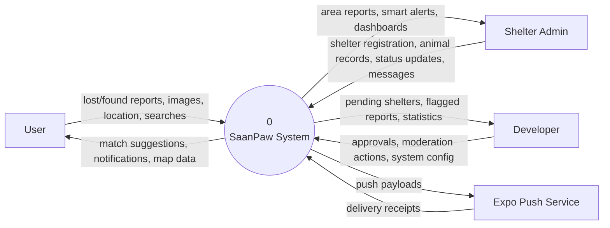
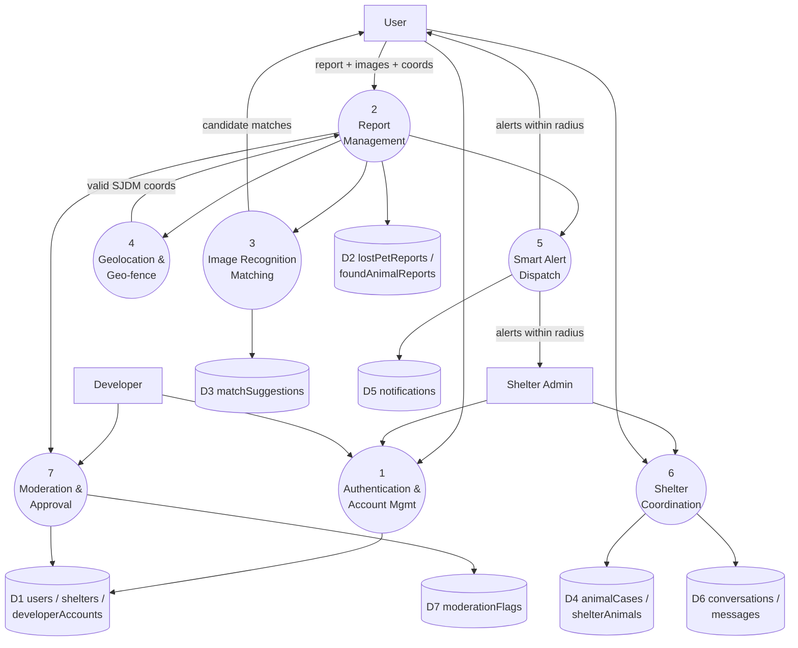

# Data Flow Diagrams (Figures 27-29)

## Figure 27 - DFD Level 0 (Context Diagram)



## Figure 28 - DFD Level 1



## Figure 29 - DFD Level 2 (explodes Process 3 - Image Recognition Matching)

> This diagrams the self-hosted embedding/cosine-similarity pipeline explored in
> `spike/image-recognition/`. It was not adopted - the implemented Process 3 is
> `matching.service.ts`: an attribute heuristic (3.1-3.3 below, unchanged) shortlists
> candidates, then Gemini vision scores the shortlisted photo pairs directly (replacing
> 3.2's embedding extraction and 3.4's cosine step) in both match directions, lost-to-found
> and found/intake-back-to-lost. `D3 imageSignatures` below does not exist; matches persist
> to `matchSuggestions` (`D3` in the Level 1 diagram above).

```mermaid
flowchart TD
    P2[From 2: Report Management\n(new report + image)]
    USR[User]

    P31(("3.1\nPreprocess Image\n(resize, normalize)"))
    P32(("3.2\nExtract Feature\nEmbedding"))
    P33(("3.3\nQuery Candidate Pool\n(opposite type, in radius, active)"))
    P34(("3.4\nScore Similarity\n(cosine)"))
    P35(("3.5\nRank & Return\nTop-N Matches"))

    D2[(lostPetReports /\nfoundAnimalReports)]
    D3[(imageSignatures)]

    P2 --> P31 --> P32
    P32 --> D3
    P32 --> P33
    D2 --> P33
    D3 --> P33
    P33 --> P34 --> P35
    P35 -->|ranked matches + scores| USR
    P35 -->|persist match links| D2
```
